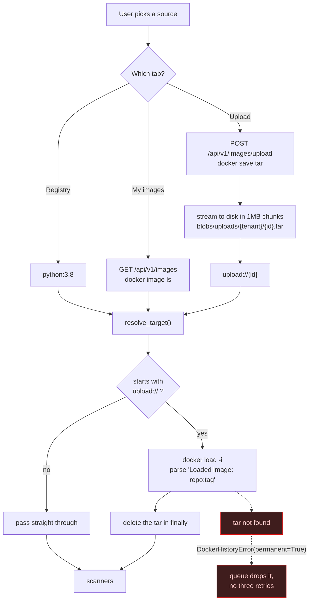
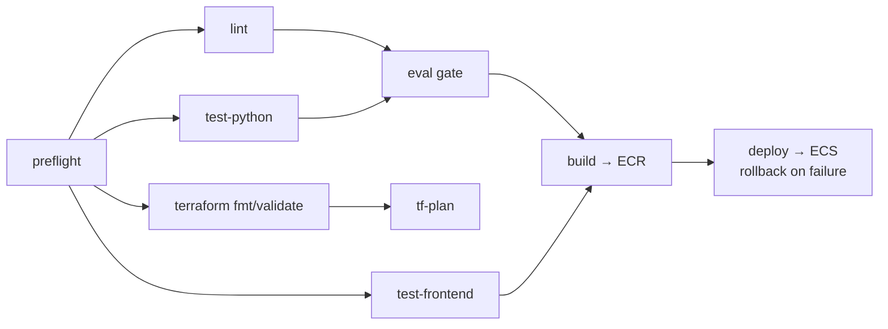
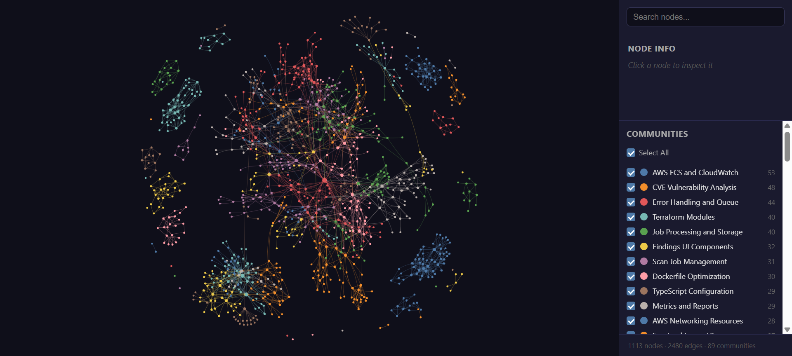

# AI-Powered Docker Repo Auditor

Point it at a container image. Six LLM agents read what three scanners found and tell you what is
wrong with it - known vulnerabilities, wasted layers, a stale base image, CIS benchmark violations -
then rewrite the Dockerfile and score the risk.

The thing it does differently: **when an agent fails, the report says so.** A timed-out agent is
recorded as `timed_out`, a crashed one as `failed`, and the score is presented as degraded rather
than quietly computed from less evidence. A scan that silently dropped a third of its analysis and
still printed a confident number is the failure mode this project is built against.


*A real report. Note the bottom panel: `Vulnerability analysis` sat at `0 ms` and reported
**"nothing to analyse"** rather than being omitted, because Trivy genuinely found zero
vulnerabilities in this image. The other five agents ran in 1.8s to 4.0s and are marked `analysed`.
The score is 30/100 because compliance is 40 and security is 20, not because anything was hidden.*

**Documentation:** [`docs/README.md`](docs/README.md) - architecture, operations, audits and
design records. This file is the overview; that is the depth.

---

## What was built

**Six-agent container-audit pipeline with a fan-out/fan-in topology.** Four independent agents run
concurrently under a 120s per-agent timeout; two dependent agents consume the fan-in.
`asyncio.gather(return_exceptions=True)` plus a `_degrade()` path isolates failure, so one dead agent
degrades the report instead of killing the scan.

**Evaluation gate wired into CI.** Blocks merge below **90% recall** across **19 seeded defects** on a
deliberately-bad fixture image, and requires **zero false positives** across 8 negative expectations on
a clean control. Score stability is measured as standard deviation plus mean Jaccard overlap of
finding-ID sets across repeat runs, so a rewrite that makes the tool erratic fails the same gate.

**Explicit trust fan-in, not a silently shorter list.** Dependent agents receive `missing_inputs()` and
`input_confidence()` from `app/agents/trust.py`, so `risk_scorer` can tell "no critical CVEs" from "the
CVE agent never ran" - the two states a naive pipeline collapses into the same clean score.

**Deterministic reduction before any model call, with a grounding guard.** `python:3.8` yields
**10,189 Trivy vulnerabilities (227 CRITICAL)**; they are ranked by severity then CVSS and truncated to
the worst **150** before a token is spent. The CVE agent then raises `AgentError` on any vulnerability
ID outside that input set, which makes a hallucinated CVE structurally unable to reach a report.

**At-least-once delivery made safe end to end.** SQS FIFO with a 60s deduplication window collapsing
repeat clicks, a conditional-write `claim_job()` so exactly one of two workers wins a redelivered
message, 300s visibility extended by a 60s heartbeat, and a `PermanentFailure` path that drops
unretryable work rather than burning all three attempts on an image that will never exist.

**Durable progress over Redis pub/sub.** Replaced in-process WebSocket fan-out, which cannot work once
more than one API task exists. DynamoDB is written before every publish, so a Redis outage degrades
delivery without failing a scan; unauthorised sockets close `1008`, never a silent `1006`.

**Deployed on AWS Fargate across 11 Terraform modules.** GitHub OIDC instead of static keys, the eval
gate inside the deploy pipeline, and rollback on failure. `SCANNER_MODE=registry` removes the
Docker-socket dependency in production entirely. 86 Python and 28 frontend tests, ruff/mypy/eslint/tsc,
plus a docs gate that diffs every code block in `docs/history/build-phases/` against the file it was copied from.

---

## Architecture

A browser talks REST and a WebSocket to FastAPI, which enqueues onto SQS FIFO; a worker
consumes, runs three scanners and six agents, and writes DynamoDB before it publishes
progress to Redis. `SCANNER_MODE=registry` removes the Docker-socket dependency in
production entirely.

> **[Architecture overview](docs/architecture/overview.md)** - the component diagram, and
> why Redis carries progress rather than in-process fan-out.
>
> **[The scan pipeline](docs/architecture/pipeline.md)** - the scan lifecycle end to end,
> the six-agent DAG and the trust fan-in.
>
> **[Observability](docs/architecture/observability.md)** - the collector, the instruments
> and what each one was added to catch.

---

## Image sources

Three ways in, one target string out - nothing downstream of the form knows there was more than one
source.



Tenant isolation here is a **directory segment, not a comparison**: uploads land under
`blobs/uploads/{tenant_id}/{upload_id}.tar`, so an id guessed from another tenant simply resolves to
a path that was never written. There is no ownership check to forget to write.

The "My images" and "Upload" tabs exist only under `SCANNER_MODE=socket`. Under
`SCANNER_MODE=registry` - which is what Fargate runs, because it has no Docker socket and mounting
one would be a privilege problem anyway - those routes return 404 and the frontend hides the tabs
entirely rather than rendering controls that cannot work.

| Registry | My images | Upload |
|---|---|---|
|  |  |  |
| Type a reference, or take a preset. | Whatever is on the daemon, with sizes. | A `docker save` tar, streamed to disk. |

---

## Quick start

```bash
# 1. API key at the repo root (see example.env)
echo "OPENAI_API_KEY=sk-..." > .env

# 2. Everything up
docker compose up --build

# 3. Frontend on :3000, API on :8080/docs

# Optional: metrics, logs and dashboards
docker compose --profile observability up -d
```

Compose brings up DynamoDB Local, ElasticMQ, Redis, a one-shot table bootstrap, the API, the worker
and the frontend. `DEV_AUTH=1` runs a local JWKS endpoint so you get a token without Cognito.

The app has an **Analytics** page (`/analytics`) with three tabs: Prometheus (what the
pipeline did, drawn in the app), OpenTelemetry (whether the collector is coping) and
Grafana (the five provisioned dashboards, embedded). The browser never talks to Prometheus
directly - a route handler queries it server-side and serves a fixed set of named panels,
so there is no open PromQL endpoint and no CORS to configure.

The `observability` profile is separate and off by default - four more containers is a real cost for a
scan you are not measuring. With it up, Grafana is on **:3001** (anonymous, no login) with five
provisioned dashboards, Prometheus on **:9090**, and Loki on **:3101**. Logs become JSON keyed on
`job_id`, so one scan's lines - including boto3's and httpx's - come back from a single filter. Nothing
is instrumented unless `OTEL_EXPORTER_OTLP_ENDPOINT` is set, which is why the default run is unchanged.
See [phase 14](docs/history/build-phases/14-observability.md).

> The API and worker both mount `/var/run/docker.sock` with `group_add: ["0"]`. That grants those
> containers root on the host. It is local development only - the Fargate task runs
> `SCANNER_MODE=registry` and mounts nothing.

### Environment

Every variable, its default and what it does:
**[docs/operations/configuration.md](docs/operations/configuration.md)**.
`example.env` is the runnable copy.

### Signing in

Locally there is no sign-in: `DEV_AUTH=1` serves a local JWKS endpoint and the UI takes a
token from it, which is why `docker compose up` drops you straight onto the scan form.

Deployed, that endpoint does not exist - `/dev/token` mints a token for **any** tenant to
**any** caller, so Terraform leaves `DEV_AUTH` unset. Set
`NEXT_PUBLIC_COGNITO_USER_POOL_ID` and `NEXT_PUBLIC_COGNITO_CLIENT_ID` (from
`terraform output`) and the UI asks for a real Cognito sign-in instead. Both are baked
into the bundle at build time, so they are build args rather than task environment -
changing them needs a rebuild, not a restart.

---

## API

| Method | Path | Notes |
|---|---|---|
| `POST` | `/api/v1/scans` | 202 + `job_id`. Rate limited per tenant. |
| `GET` | `/api/v1/scans/{job_id}` | Summary. Object-level authz - a scan you do not own is **404, not 403**. |
| `GET` | `/api/v1/scans/{job_id}/report` | Full report blob. `?format=sarif\|cyclonedx\|csv\|junit` exports it; default `json`. |
| `GET` | `/api/v1/scans/jobs/{job_id}` | Live status + progress. `stale` when a job says `running` but no worker holds its lease. |
| `GET` | `/api/v1/scans/history/{repo_id}` | Recent scans for a repo. |
| `WS` | `/ws/jobs/{job_id}` | Progress frames. Closes `1008` on auth failure. |
| `GET` | `/api/v1/images` | Daemon images. 404 in registry mode. |
| `POST` | `/api/v1/images/upload` | `docker save` tar. 404 in registry mode. |
| `GET` | `/health` | Liveness. |

---

## CI gate

```bash
python -m app.cli scan myimage:latest --fail-on-severity high --format sarif --output report.sarif
```

Exit `0` clean, `1` threshold breached, `2` the scan itself failed. The last one matters: *we
found criticals* and *we never looked* must not look the same to a pipeline.

`--fail-on-severity` counts only **unsuppressed** findings. A suppression needs a reason, may
carry an expiry, and marks the finding rather than deleting it - so an accepted risk stays in
the report, reviewable, instead of quietly disappearing from it.

---

## Layout

| Path | What lives there |
|---|---|
| `worker/app/api/` | FastAPI routes, auth deps, WebSocket |
| `worker/app/scanners/` | Trivy, `docker history`, `docker inspect` |
| `worker/app/processors/` | Deterministic reduction before any model call |
| `worker/app/agents/` | The six agents, prompts, trust fan-in |
| `worker/app/queue/` | SQS producer, consumer, handler |
| `worker/app/reporting/` | SARIF, CycloneDX, CSV, JUnit - pure functions over a stored report |
| `worker/app/policy/` | Per-tenant suppressions: marked, never deleted; expiring |
| `worker/app/storage/` | DynamoDB tables, blobs, Decimal serialization |
| `worker/eval/` | Recall / precision / stability harness |
| `frontend/` | Next.js 16 App Router, Tailwind, Vitest |
| `terraform/` | 11 modules: networking, ecr, database, queue, storage, secrets, auth, cache, iam, ecs, cicd |
| `frontend/components/charts/` | Hand-rolled SVG chart primitives for the Analytics tabs |
| `frontend/app/api/metrics/` | Server-side Prometheus proxy; named panels only, never raw PromQL |
| `worker/app/telemetry/` | Instruments and JSON logs; no-ops unless a collector is configured |
| `observability/` | Collector, Prometheus, Loki and Grafana config - dashboards as files |
| `docs/` | [The documentation](docs/README.md) - architecture, operations, audits, design records |
| `docs/history/build-phases/` | 14 phase write-ups - the design decisions and what they cost |
| `docs/code-graph/` | Generated code graph (below) |
| `scripts/` | `check_code_blocks.py`, the docs gate CI runs |

---

## Tests

```bash
cd worker
uv run pytest -m "not eval and not integration" -q   # unit
uv run pytest -m integration -q                      # needs DynamoDB Local, ElasticMQ, Redis
uv run pytest -m eval -v                             # hits the real model API, costs money
uv run ruff check . && uv run ruff format --check . && uv run mypy app eval

cd frontend
npm test && npx tsc --noEmit && npm run lint

python3 scripts/check_code_blocks.py           # phase docs still match the source
```

That last one is a real gate in CI: every code block in `docs/history/build-phases/` is checked against the file
it was copied from, so the write-ups cannot drift away from the code they describe.



---

## Code graph

`docs/code-graph/` holds a generated structural graph of the whole repo - **2,226 nodes, 4,800 edges,
133 communities, no import cycles** - built by [Graphify](https://github.com/Graphify-Labs/graphify)
from tree-sitter ASTs across Python, TypeScript and Terraform.

### ▶ [Open the interactive graph](https://prateek1771.github.io/AI-Powered-Docker-Repo-Auditor/code-graph/graph.html)

Search any symbol, click a node to see its neighbours, toggle communities on and off. Served from
GitHub Pages, alongside a [docs landing page](https://prateek1771.github.io/AI-Powered-Docker-Repo-Auditor/).
Cloned locally, just open [`docs/code-graph/graph.html`](docs/code-graph/graph.html) in a browser. The
graph data is embedded in the file, but it pulls `vis-network` from a CDN, so it needs a network
connection to draw.



| File | What it is |
|---|---|
| [`graph.html`](docs/code-graph/graph.html) | The visualisation above |
| [`GRAPH_REPORT.md`](docs/code-graph/GRAPH_REPORT.md) | Community hubs, god nodes, surprising connections |
| `graph.json` | Queryable graph |

The most connected nodes are a fair summary of where the weight sits: `AgentOutcome` (42 edges),
`cn()` (38), `run_scan_from_raw()` (34), `ScanOutcome` (33), `create_job()` (29).

`cn()` at number two is the frontend's class-name helper, which is not a core abstraction so much
as the one function every component imports - a reminder that edge count measures reach, not
importance.

Regenerate:

```bash
uv tool install "graphifyy[terraform]"
graphify extract . --code-only --out docs/code-graph   # local AST only, no API calls
```

---

## Learning trail

The reasoning behind each layer, written as it was built:

| Phase | |
|---|---|
| [01](docs/history/build-phases/01-scanner-layer.md) | Scanner layer - Trivy runner and deterministic reduction |
| [02](docs/history/build-phases/02-cve-analysis-agent.md) | The CVE analyst - structured output and fail-loud parsing |
| [03](docs/history/build-phases/03-parallel-agents.md) | Parallel agents, visible degradation, failure isolation |
| [04](docs/history/build-phases/04-dependent-agents.md) | Dependent agents, the fan-in, degraded inputs |
| [05](docs/history/build-phases/05-evaluation-harness.md) | The evaluation harness - recall, precision, stability |
| [06](docs/history/build-phases/06-persistence.md) | Persistence - hot/cold tables, tenant keys, the Decimal problem |
| [07](docs/history/build-phases/07-queue.md) | The queue - FIFO groups, visibility arithmetic, idempotency |
| [08](docs/history/build-phases/08-api-layer.md) | The API - verifying tokens, limiting cost, object-level authz |
| [09](docs/history/build-phases/09-realtime-progress.md) | Real-time progress - why in-memory fan-out cannot work |
| [10](docs/history/build-phases/10-frontend.md) | The frontend - two kinds of state, backoff, honest degradation |
| [11](docs/history/build-phases/11-containerisation.md) | Containerisation - layers, ghosts, scanning your own work |
| [12](docs/history/build-phases/12-infrastructure.md) | Infrastructure - build order, encoded fixes, what it costs |
| [13](docs/history/build-phases/13-cicd.md) | CI/CD - OIDC, matrices, rollback, the gate that matters |
| [14](docs/history/build-phases/14-observability.md) | Observability - instruments for the failures that never raise |

---

## Known limitations (audited, not hidden)

These came out of a deliberate audit of the tool against its own subject matter: every finding it
produced was checked against `docker image inspect` and an independent Trivy run. Most held up. These
three did not, and they are real and currently unfixed:

| Limitation | Detail |
|---|---|
| **CIS 4.9 can give a breaking fix** | It correctly detects `ADD`, but recommends replacing it with `COPY` even where `ADD` is auto-extracting a tarball - which `COPY` cannot do. Correct detection, destructive advice. |
| **Base-image advice goes stale** | `base_image_strategist` performs no registry lookup. It recommends from model memory, so it will name a tag that was current at training time and may be several releases behind. |
| **Vulnerability sampling is not disclosed** | Only the worst `MAX_VULNERABILITIES_TO_MODEL` (default **150**) vulnerabilities reach the model, ranked by severity then CVSS. On a badly out-of-date image that can be a small fraction of the total, and the UI does not currently show the sample size. |

What was verified as sound: CIS 4.1 (runs as root) and 4.6 (no `HEALTHCHECK`) match `docker image
inspect` exactly; a clean image genuinely reports clean rather than hiding a scanner failure; and the
CVE agent does not invent CVE IDs - `cve_analyst.py` raises `AgentError` if the model returns an ID
outside the set it was given, so a hallucinated CVE fails the agent instead of reaching a report.
