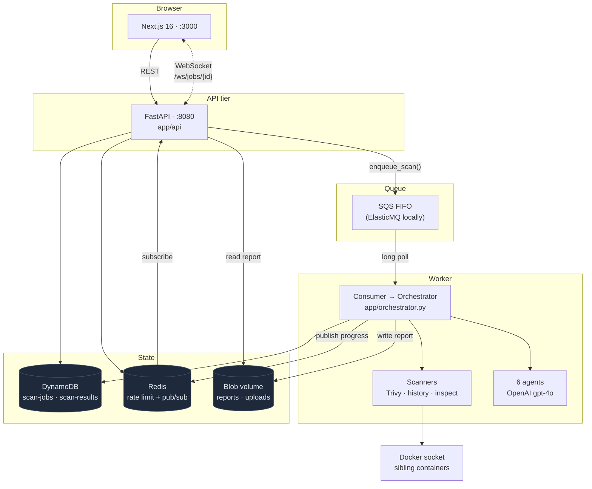
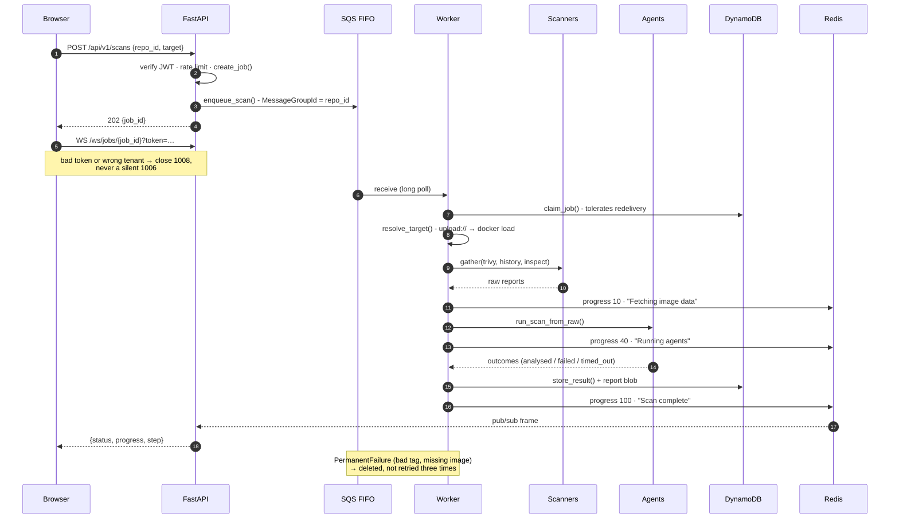
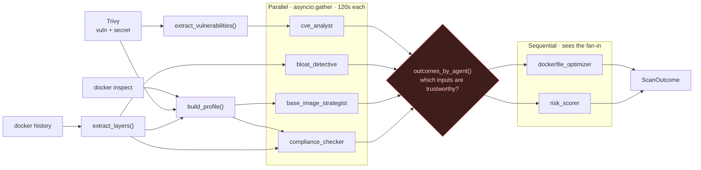
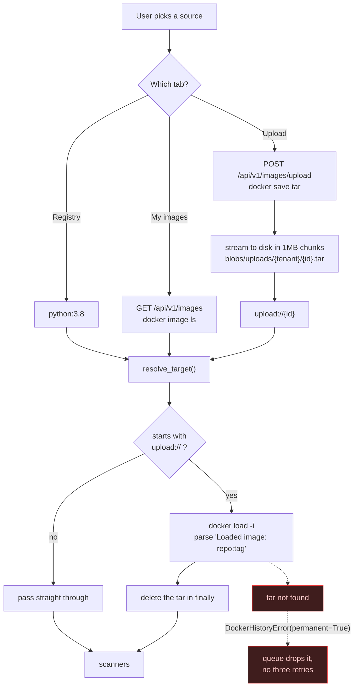
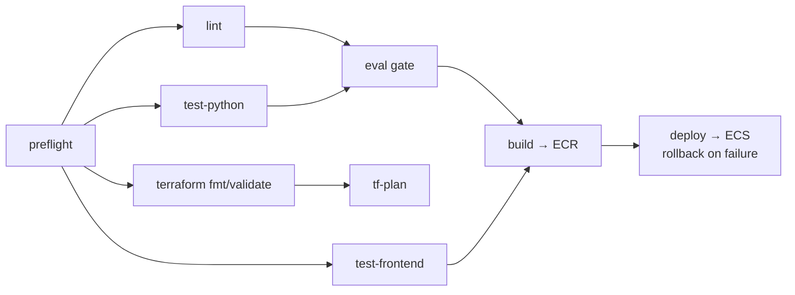

# AI-Powered Docker Repo Auditor

Point it at a container image. Six LLM agents read what three scanners found and tell you what is
wrong with it - known vulnerabilities, wasted layers, a stale base image, CIS benchmark violations -
then rewrite the Dockerfile and score the risk.

The thing it does differently: **when an agent fails, the report says so.** A timed-out agent is
recorded as `timed_out`, a crashed one as `failed`, and the score is presented as degraded rather
than quietly computed from less evidence. A scan that silently dropped a third of its analysis and
still printed a confident number is the failure mode this project is built against.

**Documentation:** [`docs/README.md`](docs/README.md) - architecture, operations, audits and
design records. This file is the overview; that is the depth.

---

## What was built

**Six-agent container-audit pipeline with a fan-out/fan-in topology.** Four independent agents run
concurrently under a 120s per-agent timeout; two dependent agents consume the fan-in.
`asyncio.gather(return_exceptions=True)` plus a `_degrade()` path isolates failure, so one dead agent
degrades the report instead of killing the scan.

**Evaluation gate wired into CI.** Blocks merge below **90% recall** across **19 seeded defects** on a
deliberately-bad fixture image, and requires **zero false positives** across 8 negative expectations on
a clean control. Score stability is measured as standard deviation plus mean Jaccard overlap of
finding-ID sets across repeat runs, so a rewrite that makes the tool erratic fails the same gate.

**Explicit trust fan-in, not a silently shorter list.** Dependent agents receive `missing_inputs()` and
`input_confidence()` from `app/agents/trust.py`, so `risk_scorer` can tell "no critical CVEs" from "the
CVE agent never ran" - the two states a naive pipeline collapses into the same clean score.

**Deterministic reduction before any model call, with a grounding guard.** `python:3.8` yields
**10,189 Trivy vulnerabilities (227 CRITICAL)**; they are ranked by severity then CVSS and truncated to
the worst **150** before a token is spent. The CVE agent then raises `AgentError` on any vulnerability
ID outside that input set, which makes a hallucinated CVE structurally unable to reach a report.

**At-least-once delivery made safe end to end.** SQS FIFO with a 60s deduplication window collapsing
repeat clicks, a conditional-write `claim_job()` so exactly one of two workers wins a redelivered
message, 300s visibility extended by a 60s heartbeat, and a `PermanentFailure` path that drops
unretryable work rather than burning all three attempts on an image that will never exist.

**Durable progress over Redis pub/sub.** Replaced in-process WebSocket fan-out, which cannot work once
more than one API task exists. DynamoDB is written before every publish, so a Redis outage degrades
delivery without failing a scan; unauthorised sockets close `1008`, never a silent `1006`.

**Deployed on AWS Fargate across 11 Terraform modules.** GitHub OIDC instead of static keys, the eval
gate inside the deploy pipeline, and rollback on failure. `SCANNER_MODE=registry` removes the
Docker-socket dependency in production entirely. 86 Python and 28 frontend tests, ruff/mypy/eslint/tsc,
plus a docs gate that diffs every code block in `docs/history/build-phases/` against the file it was copied from.

---

## Architecture



Redis carries progress because in-process fan-out cannot work once more than one API task exists -
the socket lives on whichever task the browser happened to reach, and the scan runs somewhere else
entirely. DynamoDB is written **before** the publish: the database is the source of truth, and a
client that misses an event recovers by reading state, so a Redis outage must not fail a working scan.

---

## The scan lifecycle



Every progress write is `update_progress()` **then** `bus.publish()`, and the publish sits in its own
`try` - delivery of a progress event is a nice-to-have, the scan result is not.

---

## The agent graph



The fan-in is the interesting part. `app/agents/trust.py` answers *which of my inputs can I believe?* -
`missing_inputs()` names the required agents whose output cannot be trusted, and `input_confidence()`
returns the fraction that can. The dependent agents receive that verdict rather than a silently
shorter list, so `risk_scorer` knows the difference between "no critical CVEs" and "the CVE agent
never ran".

`asyncio.gather(..., return_exceptions=True)` plus `_degrade()` is what keeps one bad agent from
killing five good ones.

Further depth, kept out of this file so it stays readable:
[observability](docs/architecture/observability.md) (the collector, the instruments and what
each was added to catch), [the LLM gateway](docs/architecture/llm-gateway.md), and
[configuration](docs/operations/configuration.md).

---

## Image sources

Three ways in, one target string out - nothing downstream of the form knows there was more than one
source.



Tenant isolation here is a **directory segment, not a comparison**: uploads land under
`blobs/uploads/{tenant_id}/{upload_id}.tar`, so an id guessed from another tenant simply resolves to
a path that was never written. There is no ownership check to forget to write.

The "My images" and "Upload" tabs exist only under `SCANNER_MODE=socket`. Under
`SCANNER_MODE=registry` - which is what Fargate runs, because it has no Docker socket and mounting
one would be a privilege problem anyway - those routes return 404 and the frontend hides the tabs
entirely rather than rendering controls that cannot work.

| Registry | My images | Upload |
|---|---|---|
| Type a reference, or take a preset. | Whatever is on the daemon, with sizes. | A `docker save` tar, streamed to disk. |

---

## Setup

Four ways to run this, in the order most people need them: [local](#local),
[the UI](#the-ui), [AWS](#aws) and [CI/CD](#cicd). Every variable named below is
documented once, in
**[docs/operations/configuration.md](docs/operations/configuration.md)**.

### Local

**You need** Docker Desktop (compose v2), an OpenAI key, and a few GB of disk. Trivy runs as
a sibling container, which is why the socket is mounted.

```bash
cp example.env .env          # then set OPENAI_API_KEY
docker compose up --build    # frontend :3000, API :8080/docs
```

That is the whole thing. Compose brings up DynamoDB Local, ElasticMQ, Redis, a one-shot
`bootstrap` job that creates the tables and retries until DynamoDB answers, the API, the
worker, the frontend and the LLM gateway. `DEV_AUTH=1` runs a local JWKS endpoint, so you get
a token without Cognito and land straight on the scan form.

Check it came up: `curl localhost:8080/health`, then open `http://localhost:3000` and scan
`alpine:3.20`.

Two things about `example.env` worth knowing before you copy it:

- It ships `LLM_GATEWAY_URL=http://bifrost:8080/v1`, so every model call routes through the
  gateway. Blank it to call OpenAI directly - that is what CI does.
- `API_PORT` moves the published port **and** the URL baked into the frontend bundle
  together, so they cannot drift apart. If 8080 is taken, change it there and nowhere else.
  (`docker-compose.override.yml` is gitignored, so you do not inherit anyone else's
  workaround.)

**Metrics, logs and dashboards** are a separate profile, off by default - four more
containers is a real cost for a scan you are not measuring:

```bash
docker compose --profile observability up -d
```

Grafana on **:3001** (anonymous, five provisioned dashboards), Prometheus on **:9090**, Loki
on **:3101**. Logs become JSON keyed on `job_id`, so one scan's lines - including boto3's and
httpx's - come back from a single filter. Nothing is instrumented unless
`OTEL_EXPORTER_OTLP_ENDPOINT` is set, which is why the default run is unchanged. See
[phase 14](docs/history/build-phases/14-observability.md).

The app's own **Analytics** page (`/analytics`) has four tabs: Prometheus (what the pipeline
did, drawn in the app), OpenTelemetry (whether the collector is coping), Gateway (what the
models cost, and whether the keys still work) and Grafana (the dashboards, embedded). The
browser never talks to Prometheus directly - a route handler queries it server-side and
serves a fixed set of named panels, so there is no open PromQL endpoint and no CORS to
configure.

> The API and worker both mount `/var/run/docker.sock` with `group_add: ["0"]`. That grants
> those containers root on the host. It is local development only - the Fargate task runs
> `SCANNER_MODE=registry` and mounts nothing.

**Without Docker for the app itself** - what the [Tests](#tests) section assumes. Python
3.12 (`worker/.python-version`) and Node 22:

```bash
docker compose up dynamodb elasticmq redis bootstrap   # backing services only

cd worker && uv sync
uv run uvicorn app.api.main:app --port 8080            # the API
uv run python -m app.main                              # the worker

cd frontend && npm ci && npm run dev
```

`npm run dev` needs `NEXT_PUBLIC_API_URL` and `NEXT_PUBLIC_WS_URL` set in the shell - there
is no `.env.local` in the repo, and `frontend/lib/api.ts` reads the first with a non-null
assertion.

**No services at all.** The CLI runs the whole pipeline in-process:

```bash
cd worker && uv run python -m app.cli scan alpine:3.20 --fail-on-severity high
```

**Teardown:** `docker compose down -v`. The named volumes hold DynamoDB data, report blobs,
Prometheus and Loki data, and the gateway's SQLite config.

### The UI

Five `NEXT_PUBLIC_*` values are **build args**, not runtime environment. `frontend/Dockerfile`
promotes each `ARG` to an `ENV` because an `ARG` alone is invisible to `npm run build`.
**Changing any of them needs `docker compose up --build`, not a restart.**

| Variable | What it does |
|---|---|
| `NEXT_PUBLIC_API_URL`, `NEXT_PUBLIC_WS_URL` | Must be **host-reachable** - the bundle runs in a browser outside the compose network, so `http://localhost:8080`, never `http://api:8080`. |
| `NEXT_PUBLIC_COGNITO_USER_POOL_ID`, `NEXT_PUBLIC_COGNITO_CLIENT_ID` | Empty selects the `DEV_AUTH` token path. Set both and the UI requires a real Cognito sign-in. |
| `NEXT_PUBLIC_GRAFANA_URL` | Where the browser reaches Grafana for the embed. Empty hides that tab. |

`PROMETHEUS_URL` is the exception: server-side only, deliberately **not** `NEXT_PUBLIC_`. An
open PromQL endpoint is the wrong thing to ship from a product whose job is finding those.

**Signing in.** Locally there is none - `DEV_AUTH=1` serves a local JWKS endpoint and the UI
takes a token from it. Deployed, that endpoint does not exist: `/dev/token` mints a token for
**any** tenant to **any** caller, so Terraform leaves `DEV_AUTH` unset. Set the two Cognito
values from `terraform output` and rebuild.

### AWS

**Read this first.** This stack **has never completed a green deploy**, and there is no
`aws_lb`, no ACM certificate, no HTTPS listener, no CloudWatch alarm, no autoscaling and no
KMS CMK anywhere in `terraform/`. Tasks carry public IPs, so tokens and reports cross the
internet in clear text, and there is no hostname to output because nothing stable exists to
name. Treat what follows as the documented path, not a proven one - see
[improvements](docs/design/improvements.md) and [audit 01](docs/audits/audit-01-backend.md)
P4-2, which is still open: the OpenAI key is written into Terraform state, in a bucket this
stack does not manage.

You need Terraform `>= 1.10, < 2.0` and AWS credentials **for a human**. CI cannot do this:
its Terraform role is read-only plus state writes, and is plan-only on purpose - an automatic
apply on merge can delete a database, and that decision belongs to a person at a terminal.

**1. Set a billing alarm.** Before `apply`, not after. Nothing here creates one.

**2. Create the state bucket by hand.** `backend "s3" {}` is deliberately empty: a committed
bucket name is either wrong for whoever clones this or points at someone else's. There is no
bootstrap stack. Create the bucket, enable versioning and encryption, and block public
access - the exact calls are in
[phase 12](docs/history/build-phases/12-infrastructure.md).

**3. Init against it.** No DynamoDB lock table: `dynamodb_table` was removed in Terraform
1.13, and S3 native locking replaces it.

```bash
cd terraform
terraform init \
  -backend-config="bucket=$BUCKET" \
  -backend-config="key=dev/terraform.tfstate" \
  -backend-config="region=us-east-1" \
  -backend-config="use_lockfile=true" \
  -backend-config="encrypt=true"
```

**4. Set the two variables that have no default.** `cp terraform.tfvars.example
terraform.tfvars`, then set `llm_api_key` and `github_repository` (`owner/repo`, validated).

**5. Apply in stages.** Not one command - ten modules on the first attempt produces an error
you cannot read:

```bash
terraform apply -target=module.networking -target=module.ecr
terraform apply -target=module.database -target=module.queue -target=module.storage
terraform apply -target=module.secrets -target=module.auth -target=module.iam
# push images (below), then:
terraform apply
```

`-target` is a debugging tool. Use it for the first build to keep the blast radius small,
then never again.

**6. Push images before the ECS apply**, or tasks fail pulling a tag that does not exist. The
worker uses the **`worker-aws`** target - there is no Docker socket in a Fargate task. Tag
with the commit SHA: the ECR repositories are immutable and `image_tag` has a validation that
rejects `latest`.

**7. Wire up the rest.** `terraform output` gives you the three GitHub role ARNs and the
Cognito IDs - see [CI/CD](#cicd) for where each goes. Then set `state_bucket` to the real
bucket and apply again, or the CI Terraform role has no state access and can never plan.

**8. Create a Cognito user.** Nothing in Terraform creates one and there is no hosted UI.

Three failures you are likely to hit, and what they actually mean:

| Symptom | Cause |
|---|---|
| `RegisterTaskDefinition` denied, naming `PassRole` rather than a role | The role is missing from the `iam:PassRole` scope in `main.tf` |
| The API task crash-loops at startup | `TOKEN_ISSUER` unset - `assert_production_auth()` treats that as refuse-to-start, because python-jose skips the issuer check entirely when it is absent |
| boto3 credential errors in the worker log | A missing task-role permission. The error names the action, which names the statement to add |

To stop paying without destroying anything, set `worker_count` and `api_count` to `0`.
`tier=production` switches to private subnets, NAT, Container Insights and ElastiCache.

### CI/CD

`.github/workflows/ci.yml`. No stored AWS keys - every AWS job mints a short-lived token
through GitHub OIDC.

**Repository secrets** (Settings → Secrets → Actions):

| Secret | From |
|---|---|
| `AWS_DEPLOY_ROLE_ARN` | `terraform output github_deploy_role_arn`. Also the master switch: unset, and build/deploy/smoke skip instead of failing |
| `AWS_BUILD_ROLE_ARN` | `terraform output github_build_role_arn` |
| `AWS_TERRAFORM_ROLE_ARN` | `terraform output github_terraform_role_arn`. No fallback to the deploy role on purpose - that role cannot read state, so a plan could not work even in principle |
| `TF_STATE_BUCKET` | The bucket from step 2 |
| `OPENAI_API_KEY` | Funds the eval gate. Unset, and it skips rather than fails |

**Repository variables** - variables, not secrets, because they end up in the browser bundle:
`NEXT_PUBLIC_API_URL`, `NEXT_PUBLIC_WS_URL`, `NEXT_PUBLIC_COGNITO_USER_POOL_ID`,
`NEXT_PUBLIC_COGNITO_CLIENT_ID`, and `API_URL` for the smoke test - which you set by hand,
because tasks get a fresh public IP on every deploy and there is no load balancer.

**What blocks a merge:** `lint`, `test-python`, `test-frontend` and `terraform` run on every
pull request. Everything else is push-to-main only.

**The eval gate** runs on main only, capped at `MAX_VULNERABILITIES_TO_MODEL=25`, and caches
scanner output on the fixture hash so a prompt-only change pays for model calls but not for
re-scanning. A skipped eval still allows deploy; only a failing one blocks it.

**The trust policy is the security boundary.** The build and Terraform roles trust exactly
two subjects, and the deploy role only the first:

```hcl
values = [
  "repo:${var.github_repository}:ref:refs/heads/${var.deploy_branch}",
  "repo:${var.github_repository}:pull_request",
]
```

`StringEquals`, not `StringLike`. It used to be `repo:<repo>:*`, which let a token minted on
any branch assume a role holding `ecr:PutImage` - and combined with mutable tags, that is a
path from "can push a branch" to "runs code as the task role".

**GitHub Pages**: `pages.yml` publishes `docs/` as-is. Settings → Pages → Source must be
**GitHub Actions**, not a branch.

**The chicken and egg:** the Terraform CI authenticates against is the same Terraform that
*creates* those roles. So the first apply is manual (above), the ARNs go into Actions
secrets, and CI takes over from there. `image_tag` defaults to `bootstrap` for exactly that
first apply - nothing will pull it, and CI registers its own revision anyway.

---

## API

| Method | Path | Notes |
|---|---|---|
| `POST` | `/api/v1/scans` | 202 + `job_id`. Rate limited per tenant. |
| `GET` | `/api/v1/scans/{job_id}` | Summary. Object-level authz - a scan you do not own is **404, not 403**. |
| `GET` | `/api/v1/scans/{job_id}/report` | Full report blob. `?format=sarif\|cyclonedx\|csv\|junit` exports it; default `json`. |
| `GET` | `/api/v1/scans/jobs/{job_id}` | Live status + progress. `stale` when a job says `running` but no worker holds its lease. |
| `GET` | `/api/v1/scans/history/{repo_id}` | Recent scans for a repo. |
| `WS` | `/ws/jobs/{job_id}` | Progress frames. Closes `1008` on auth failure. |
| `GET` | `/api/v1/images` | Daemon images. 404 in registry mode. |
| `POST` | `/api/v1/images/upload` | `docker save` tar. 404 in registry mode. |
| `GET` | `/health` | Liveness. |

---

## CI gate

```bash
python -m app.cli scan myimage:latest --fail-on-severity high --format sarif --output report.sarif
```

Exit `0` clean, `1` threshold breached, `2` the scan itself failed. The last one matters: *we
found criticals* and *we never looked* must not look the same to a pipeline.

`--fail-on-severity` counts only **unsuppressed** findings. A suppression needs a reason, may
carry an expiry, and marks the finding rather than deleting it - so an accepted risk stays in
the report, reviewable, instead of quietly disappearing from it.

---

## Layout

| Path | What lives there |
|---|---|
| `worker/app/api/` | FastAPI routes, auth deps, WebSocket |
| `worker/app/scanners/` | Trivy, `docker history`, `docker inspect` |
| `worker/app/processors/` | Deterministic reduction before any model call |
| `worker/app/agents/` | The six agents, prompts, trust fan-in |
| `worker/app/queue/` | SQS producer, consumer, handler |
| `worker/app/reporting/` | SARIF, CycloneDX, CSV, JUnit - pure functions over a stored report |
| `worker/app/policy/` | Per-tenant suppressions: marked, never deleted; expiring |
| `worker/app/storage/` | DynamoDB tables, blobs, Decimal serialization |
| `worker/eval/` | Recall / precision / stability harness |
| `frontend/` | Next.js 16 App Router, Tailwind, Vitest |
| `terraform/` | 11 modules: networking, ecr, database, queue, storage, secrets, auth, cache, iam, ecs, cicd |
| `frontend/components/charts/` | Hand-rolled SVG chart primitives for the Analytics tabs |
| `frontend/app/api/metrics/` | Server-side Prometheus proxy; named panels only, never raw PromQL |
| `worker/app/telemetry/` | Instruments and JSON logs; no-ops unless a collector is configured |
| `observability/` | Collector, Prometheus, Loki and Grafana config - dashboards as files |
| `docs/` | [The documentation](docs/README.md) - architecture, operations, audits, design records |
| `docs/history/build-phases/` | 14 phase write-ups - the design decisions and what they cost |
| `docs/code-graph/` | Generated code graph (below) |
| `scripts/` | `check_code_blocks.py`, the docs gate CI runs |

---

## Tests

```bash
cd worker
uv run pytest -m "not eval and not integration" -q   # unit
uv run pytest -m integration -q                      # needs DynamoDB Local, ElasticMQ, Redis
uv run pytest -m eval -v                             # hits the real model API, costs money
uv run ruff check . && uv run ruff format --check . && uv run mypy app eval

cd frontend
npm test && npx tsc --noEmit && npm run lint

python3 scripts/check_code_blocks.py           # phase docs still match the source
```

That last one is a real gate in CI: every code block in `docs/history/build-phases/` is checked against the file
it was copied from, so the write-ups cannot drift away from the code they describe.



---

## Code graph

`docs/code-graph/` holds a generated structural graph of the whole repo - **2,226 nodes, 4,800 edges,
133 communities, no import cycles** - built by [Graphify](https://github.com/Graphify-Labs/graphify)
from tree-sitter ASTs across Python, TypeScript and Terraform.

### ▶ [Open the interactive graph](https://prateek1771.github.io/AI-Powered-Docker-Repo-Auditor/code-graph/graph.html)

Search any symbol, click a node to see its neighbours, toggle communities on and off. Served from
GitHub Pages, alongside a [docs landing page](https://prateek1771.github.io/AI-Powered-Docker-Repo-Auditor/).
Cloned locally, just open [`docs/code-graph/graph.html`](docs/code-graph/graph.html) in a browser. The
graph data is embedded in the file, but it pulls `vis-network` from a CDN, so it needs a network
connection to draw.


| File | What it is |
|---|---|
| [`graph.html`](docs/code-graph/graph.html) | The visualisation above |
| [`GRAPH_REPORT.md`](docs/code-graph/GRAPH_REPORT.md) | Community hubs, god nodes, surprising connections |
| `graph.json` | Queryable graph |

The communities in the sidebar are named after a representative node - `sarif.py`,
`ScanSummary`, `ecs/variables.tf`. Graphify names them with a model when one is reachable
and falls back to node names when it is not, which is what happened on the last build.
Clustering itself is local and unaffected.

The most connected nodes are a fair summary of where the weight sits: `AgentOutcome` (42 edges),
`cn()` (38), `run_scan_from_raw()` (34), `ScanOutcome` (33), `create_job()` (29).

`cn()` at number two is the frontend's class-name helper, which is not a core abstraction so much
as the one function every component imports - a reminder that edge count measures reach, not
importance.

Regenerate:

```bash
uv tool install "graphifyy[terraform]"
graphify extract . --code-only --out docs/code-graph   # local AST only, no API calls
```

---

## Learning trail

The reasoning behind each layer, written as it was built:

| Phase | |
|---|---|
| [01](docs/history/build-phases/01-scanner-layer.md) | Scanner layer - Trivy runner and deterministic reduction |
| [02](docs/history/build-phases/02-cve-analysis-agent.md) | The CVE analyst - structured output and fail-loud parsing |
| [03](docs/history/build-phases/03-parallel-agents.md) | Parallel agents, visible degradation, failure isolation |
| [04](docs/history/build-phases/04-dependent-agents.md) | Dependent agents, the fan-in, degraded inputs |
| [05](docs/history/build-phases/05-evaluation-harness.md) | The evaluation harness - recall, precision, stability |
| [06](docs/history/build-phases/06-persistence.md) | Persistence - hot/cold tables, tenant keys, the Decimal problem |
| [07](docs/history/build-phases/07-queue.md) | The queue - FIFO groups, visibility arithmetic, idempotency |
| [08](docs/history/build-phases/08-api-layer.md) | The API - verifying tokens, limiting cost, object-level authz |
| [09](docs/history/build-phases/09-realtime-progress.md) | Real-time progress - why in-memory fan-out cannot work |
| [10](docs/history/build-phases/10-frontend.md) | The frontend - two kinds of state, backoff, honest degradation |
| [11](docs/history/build-phases/11-containerisation.md) | Containerisation - layers, ghosts, scanning your own work |
| [12](docs/history/build-phases/12-infrastructure.md) | Infrastructure - build order, encoded fixes, what it costs |
| [13](docs/history/build-phases/13-cicd.md) | CI/CD - OIDC, matrices, rollback, the gate that matters |
| [14](docs/history/build-phases/14-observability.md) | Observability - instruments for the failures that never raise |

---

## Known limitations (audited, not hidden)

These came out of a deliberate audit of the tool against its own subject matter: every finding it
produced was checked against `docker image inspect` and an independent Trivy run. Most held up. These
three did not, and they are real and currently unfixed:

| Limitation | Detail |
|---|---|
| **CIS 4.9 can give a breaking fix** | It correctly detects `ADD`, but recommends replacing it with `COPY` even where `ADD` is auto-extracting a tarball - which `COPY` cannot do. Correct detection, destructive advice. |
| **Base-image advice goes stale** | `base_image_strategist` performs no registry lookup. It recommends from model memory, so it will name a tag that was current at training time and may be several releases behind. |
| **Vulnerability sampling is lossy** | Only the worst `MAX_VULNERABILITIES_TO_MODEL` (default **150**) vulnerabilities reach the model, ranked by severity then CVSS. On a badly out-of-date image that is a small fraction of the total - `python:3.8` yields 10,189. The report does now say so (`CoverageNotice` names the count analysed and the count dropped), but the findings are still the worst of them, not all of them. |

What was verified as sound: CIS 4.1 (runs as root) and 4.6 (no `HEALTHCHECK`) match `docker image
inspect` exactly; a clean image genuinely reports clean rather than hiding a scanner failure; and the
CVE agent does not invent CVE IDs - `cve_analyst.py` raises `AgentError` if the model returns an ID
outside the set it was given, so a hallucinated CVE fails the agent instead of reaching a report.
