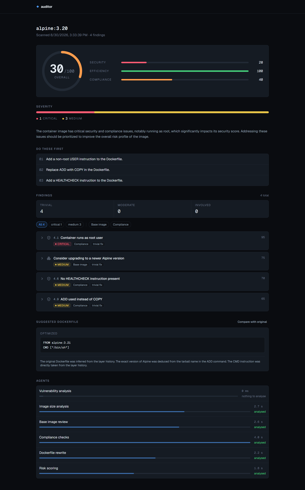
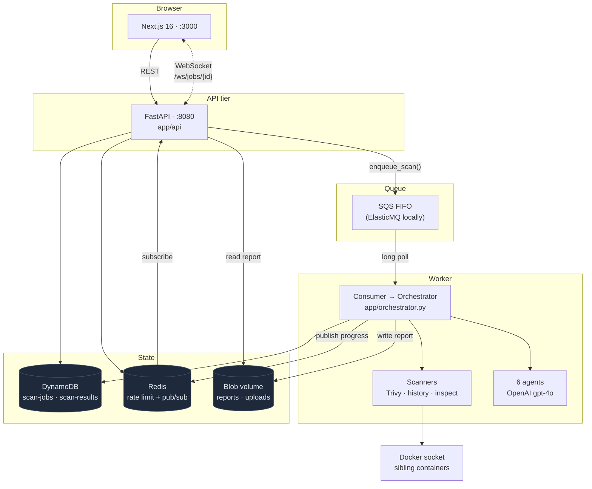
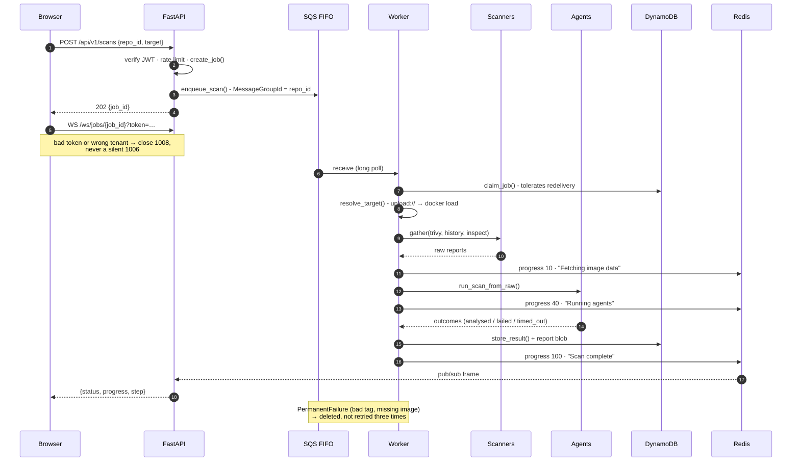
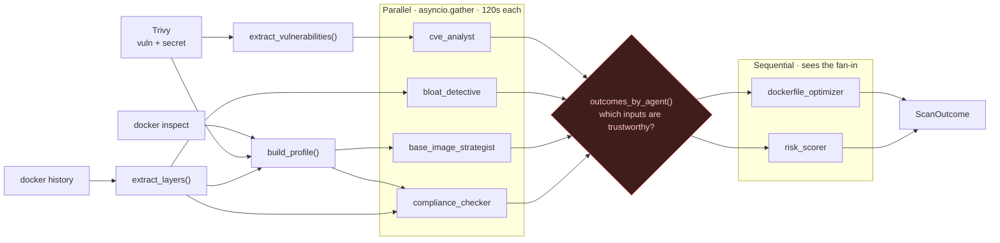
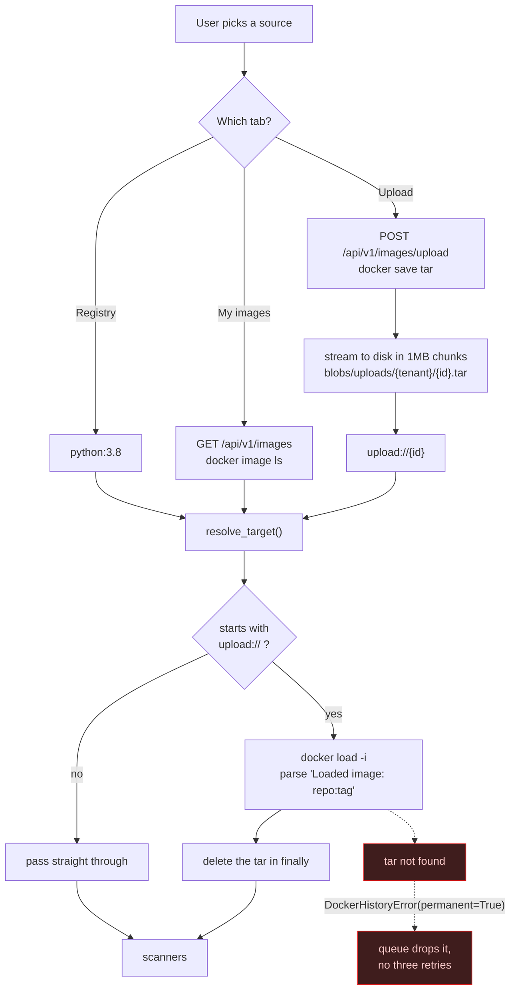
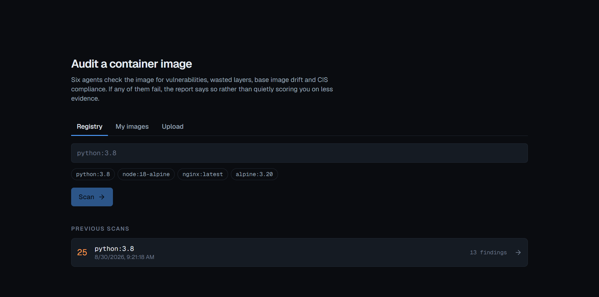
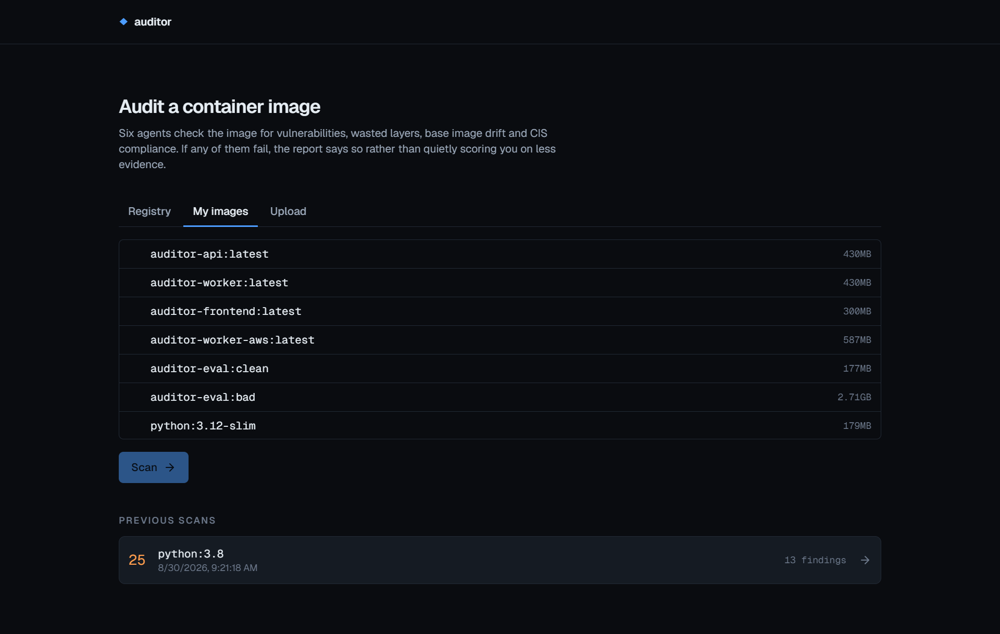
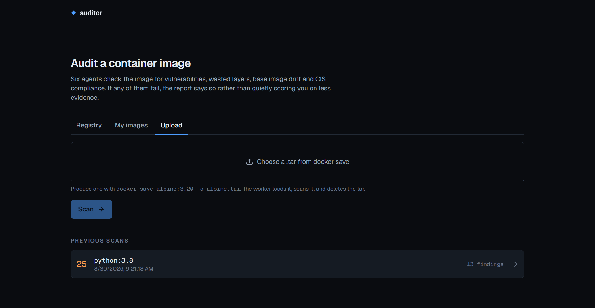
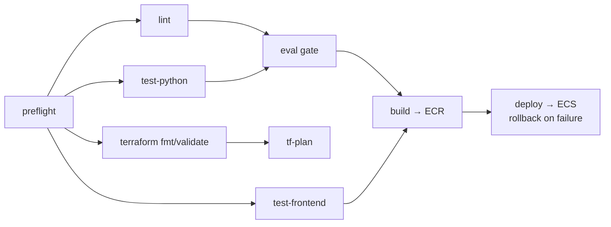
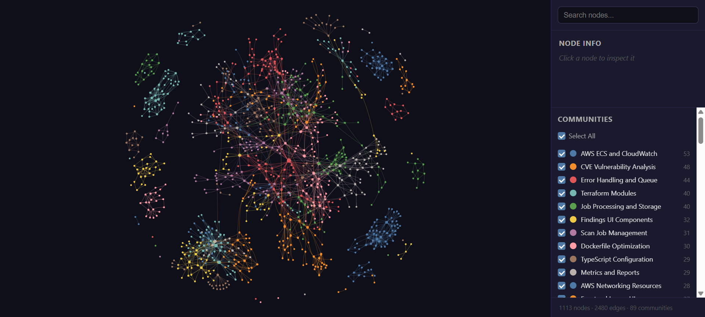

# AI-Powered Docker Repo Auditor

Point it at a container image. Six LLM agents read what three scanners found and tell you what is
wrong with it - known vulnerabilities, wasted layers, a stale base image, CIS benchmark violations -
then rewrite the Dockerfile and score the risk.

The thing it does differently: **when an agent fails, the report says so.** A timed-out agent is
recorded as `timed_out`, a crashed one as `failed`, and the score is presented as degraded rather
than quietly computed from less evidence. A scan that silently dropped a third of its analysis and
still printed a confident number is the failure mode this project is built against.



*A real report. Note the bottom panel: `Vulnerability analysis` sat at `0 ms` and reported
**"nothing to analyse"** rather than being omitted, because Trivy genuinely found zero
vulnerabilities in this image. The other five agents ran in 1.8s to 4.0s and are marked `analysed`.
The score is 30/100 because compliance is 40 and security is 20, not because anything was hidden.*

---

## What was built

**Six-agent container-audit pipeline with a fan-out/fan-in topology.** Four independent agents run
concurrently under a 120s per-agent timeout; two dependent agents consume the fan-in.
`asyncio.gather(return_exceptions=True)` plus a `_degrade()` path isolates failure, so one dead agent
degrades the report instead of killing the scan.

**Evaluation gate wired into CI.** Blocks merge below **90% recall** across **19 seeded defects** on a
deliberately-bad fixture image, and requires **zero false positives** across 8 negative expectations on
a clean control. Score stability is measured as standard deviation plus mean Jaccard overlap of
finding-ID sets across repeat runs, so a rewrite that makes the tool erratic fails the same gate.

**Explicit trust fan-in, not a silently shorter list.** Dependent agents receive `missing_inputs()` and
`input_confidence()` from `app/agents/trust.py`, so `risk_scorer` can tell "no critical CVEs" from "the
CVE agent never ran" - the two states a naive pipeline collapses into the same clean score.

**Deterministic reduction before any model call, with a grounding guard.** `python:3.8` yields
**10,189 Trivy vulnerabilities (227 CRITICAL)**; they are ranked by severity then CVSS and truncated to
the worst **150** before a token is spent. The CVE agent then raises `AgentError` on any vulnerability
ID outside that input set, which makes a hallucinated CVE structurally unable to reach a report.

**At-least-once delivery made safe end to end.** SQS FIFO with a 60s deduplication window collapsing
repeat clicks, a conditional-write `claim_job()` so exactly one of two workers wins a redelivered
message, 300s visibility extended by a 60s heartbeat, and a `PermanentFailure` path that drops
unretryable work rather than burning all three attempts on an image that will never exist.

**Durable progress over Redis pub/sub.** Replaced in-process WebSocket fan-out, which cannot work once
more than one API task exists. DynamoDB is written before every publish, so a Redis outage degrades
delivery without failing a scan; unauthorised sockets close `1008`, never a silent `1006`.

**Deployed on AWS Fargate across 11 Terraform modules.** GitHub OIDC instead of static keys, the eval
gate inside the deploy pipeline, and rollback on failure. `SCANNER_MODE=registry` removes the
Docker-socket dependency in production entirely. 86 Python and 28 frontend tests, ruff/mypy/eslint/tsc,
plus a docs gate that diffs every code block in `docs/learning/` against the file it was copied from.

---

## Architecture



Redis carries progress because in-process fan-out cannot work once more than one API task exists -
the socket lives on whichever task the browser happened to reach, and the scan runs somewhere else
entirely. DynamoDB is written **before** the publish: the database is the source of truth, and a
client that misses an event recovers by reading state, so a Redis outage must not fail a working scan.

---

## The scan lifecycle



Every progress write is `update_progress()` **then** `bus.publish()`, and the publish sits in its own
`try` - delivery of a progress event is a nice-to-have, the scan result is not.

---

## The agent graph



The fan-in is the interesting part. `app/agents/trust.py` answers *which of my inputs can I believe?* -
`missing_inputs()` names the required agents whose output cannot be trusted, and `input_confidence()`
returns the fraction that can. The dependent agents receive that verdict rather than a silently
shorter list, so `risk_scorer` knows the difference between "no critical CVEs" and "the CVE agent
never ran".

`asyncio.gather(..., return_exceptions=True)` plus `_degrade()` is what keeps one bad agent from
killing five good ones.

---

## Image sources

Three ways in, one target string out - nothing downstream of the form knows there was more than one
source.



Tenant isolation here is a **directory segment, not a comparison**: uploads land under
`blobs/uploads/{tenant_id}/{upload_id}.tar`, so an id guessed from another tenant simply resolves to
a path that was never written. There is no ownership check to forget to write.

The "My images" and "Upload" tabs exist only under `SCANNER_MODE=socket`. Under
`SCANNER_MODE=registry` - which is what Fargate runs, because it has no Docker socket and mounting
one would be a privilege problem anyway - those routes return 404 and the frontend hides the tabs
entirely rather than rendering controls that cannot work.

| Registry | My images | Upload |
|---|---|---|
|  |  |  |
| Type a reference, or take a preset. | Whatever is on the daemon, with sizes. | A `docker save` tar, streamed to disk. |

---

## Quick start

```bash
# 1. API key at the repo root (see example.env)
echo "OPENAI_API_KEY=sk-..." > .env

# 2. Everything up
docker compose up --build

# 3. Frontend on :3000, API on :8080/docs
```

Compose brings up DynamoDB Local, ElasticMQ, Redis, a one-shot table bootstrap, the API, the worker
and the frontend. `DEV_AUTH=1` runs a local JWKS endpoint so you get a token without Cognito.

> The API and worker both mount `/var/run/docker.sock` with `group_add: ["0"]`. That grants those
> containers root on the host. It is local development only - the Fargate task runs
> `SCANNER_MODE=registry` and mounts nothing.

### Environment

| Variable | Default | Meaning |
|---|---|---|
| `OPENAI_API_KEY` | - | Required. All six agents. |
| `SCANNER_MODE` | `socket` | `socket` (sibling containers) or `registry` (Trivy binary, history from the report). |
| `CVE_MODEL` | `gpt-4o` | Model for the agents. |
| `MAX_VULNERABILITIES_TO_MODEL` | `150` | Worst-N sent to the CVE agent. |
| `AGENT_TIMEOUT_SECONDS` | `120` | Per agent; exceeding it degrades, never kills the scan. |
| `MAX_UPLOAD_BYTES` | `2 GiB` | Tar upload ceiling; overflow deletes the partial file. |
| `BLOB_DIR` | `./.blobs` | Reports and uploads. Shared volume between API and worker. |
| `DEV_AUTH` | `0` | `1` mounts a local `/dev` JWKS + token issuer. |
| `SCAN_QUEUE_URL`, `SQS_ENDPOINT_URL`, `DYNAMODB_ENDPOINT_URL`, `REDIS_URL` | local | Point at LocalStack-style services or real AWS. |

---

## API

| Method | Path | Notes |
|---|---|---|
| `POST` | `/api/v1/scans` | 202 + `job_id`. Rate limited per tenant. |
| `GET` | `/api/v1/scans/{job_id}` | Summary. Object-level authz - a scan you do not own is **404, not 403**. |
| `GET` | `/api/v1/scans/{job_id}/report` | Full report blob. |
| `GET` | `/api/v1/scans/jobs/{job_id}` | Live status + progress. |
| `GET` | `/api/v1/scans/history/{repo_id}` | Recent scans for a repo. |
| `WS` | `/ws/jobs/{job_id}` | Progress frames. Closes `1008` on auth failure. |
| `GET` | `/api/v1/images` | Daemon images. 404 in registry mode. |
| `POST` | `/api/v1/images/upload` | `docker save` tar. 404 in registry mode. |
| `GET` | `/health` | Liveness. |

---

## Layout

| Path | What lives there |
|---|---|
| `worker/app/api/` | FastAPI routes, auth deps, WebSocket |
| `worker/app/scanners/` | Trivy, `docker history`, `docker inspect` |
| `worker/app/processors/` | Deterministic reduction before any model call |
| `worker/app/agents/` | The six agents, prompts, trust fan-in |
| `worker/app/queue/` | SQS producer, consumer, handler |
| `worker/app/storage/` | DynamoDB tables, blobs, Decimal serialization |
| `worker/eval/` | Recall / precision / stability harness |
| `frontend/` | Next.js 16 App Router, Tailwind, Vitest |
| `terraform/` | 11 modules: networking, ecr, database, queue, storage, secrets, auth, cache, iam, ecs, cicd |
| `docs/learning/` | 13 phase write-ups - the design decisions and what they cost |
| `docs/code_graph/` | Generated code graph (below) |

---

## Tests

```bash
cd worker
uv run pytest -m "not eval and not integration" -q   # unit
uv run pytest -m integration -q                      # needs DynamoDB Local, ElasticMQ, Redis
uv run pytest -m eval -v                             # hits the real model API, costs money
uv run ruff check . && uv run ruff format --check . && uv run mypy app eval

cd frontend
npm test && npx tsc --noEmit && npm run lint

python3 docs/learning/check_code_blocks.py           # phase docs still match the source
```

That last one is a real gate in CI: every code block in `docs/learning/` is checked against the file
it was copied from, so the write-ups cannot drift away from the code they describe.



---

## Code graph

`docs/code_graph/` holds a generated structural graph of the whole repo - **1,113 nodes, 2,480 edges,
89 communities, no import cycles** - built by [Graphify](https://github.com/Graphify-Labs/graphify)
from tree-sitter ASTs across Python, TypeScript and Terraform.

### ▶ [Open the interactive graph](https://prateek1771.github.io/AI-Powered-Docker-Repo-Auditor/code_graph/graph.html)

Search any symbol, click a node to see its neighbours, toggle communities on and off. Served from
GitHub Pages, alongside a [docs landing page](https://prateek1771.github.io/AI-Powered-Docker-Repo-Auditor/).
Cloned locally, just open [`docs/code_graph/graph.html`](docs/code_graph/graph.html) in a browser. The
graph data is embedded in the file, but it pulls `vis-network` from a CDN, so it needs a network
connection to draw.



| File | What it is |
|---|---|
| [`graph.html`](docs/code_graph/graph.html) | The visualisation above |
| [`GRAPH_REPORT.md`](docs/code_graph/GRAPH_REPORT.md) | Community hubs, god nodes, surprising connections |
| `graph.json` | Queryable graph |

The most connected nodes are a fair summary of where the weight sits: `AgentOutcome` (29 edges),
`DockerHistoryError` (25), `create_job()` (24), `ScanOutcome` (23), `run_and_store()` (21).

Regenerate:

```bash
uv tool install "graphifyy[terraform]"
graphify extract . --code-only --out <dir>   # local AST only, no API calls
```

---

## Learning trail

The reasoning behind each layer, written as it was built:

| Phase | |
|---|---|
| [01](docs/learning/phase_01_scannse_layer.md) | Scanner layer - Trivy runner and deterministic reduction |
| [02](docs/learning/phase_02_CVE_Analysis_agent.md) | The CVE analyst - structured output and fail-loud parsing |
| [03](docs/learning/phase_03_parallel_agents.md) | Parallel agents, visible degradation, failure isolation |
| [04](docs/learning/phase_04_dependent_agents.md) | Dependent agents, the fan-in, degraded inputs |
| [05](docs/learning/phase_05_Evaluation_harness.md) | The evaluation harness - recall, precision, stability |
| [06](docs/learning/phase_06_persistence.md) | Persistence - hot/cold tables, tenant keys, the Decimal problem |
| [07](docs/learning/phase_07_Queue.md) | The queue - FIFO groups, visibility arithmetic, idempotency |
| [08](docs/learning/phase_08_api_layer.md) | The API - verifying tokens, limiting cost, object-level authz |
| [09](docs/learning/phase_09_realtime_process.md) | Real-time progress - why in-memory fan-out cannot work |
| [10](docs/learning/phase_10_frontend.md) | The frontend - two kinds of state, backoff, honest degradation |
| [11](docs/learning/phase_11_containerisation.md) | Containerisation - layers, ghosts, scanning your own work |
| [12](docs/learning/phase_12_infrastructure.md) | Infrastructure - build order, encoded fixes, what it costs |
| [13](docs/learning/phase_13_cicd.md) | CI/CD - OIDC, matrices, rollback, the gate that matters |

---

## Known limitations (audited, not hidden)

These came out of a deliberate audit of the tool against its own subject matter: every finding it
produced was checked against `docker image inspect` and an independent Trivy run. Most held up. These
three did not, and they are real and currently unfixed:

| Limitation | Detail |
|---|---|
| **CIS 4.9 can give a breaking fix** | It correctly detects `ADD`, but recommends replacing it with `COPY` even where `ADD` is auto-extracting a tarball - which `COPY` cannot do. Correct detection, destructive advice. |
| **Base-image advice goes stale** | `base_image_strategist` performs no registry lookup. It recommends from model memory, so it will name a tag that was current at training time and may be several releases behind. |
| **Vulnerability sampling is not disclosed** | Only the worst `MAX_VULNERABILITIES_TO_MODEL` (default **150**) vulnerabilities reach the model, ranked by severity then CVSS. On a badly out-of-date image that can be a small fraction of the total, and the UI does not currently show the sample size. |

What was verified as sound: CIS 4.1 (runs as root) and 4.6 (no `HEALTHCHECK`) match `docker image
inspect` exactly; a clean image genuinely reports clean rather than hiding a scanner failure; and the
CVE agent does not invent CVE IDs - `cve_analyst.py` raises `AgentError` if the model returns an ID
outside the set it was given, so a hallucinated CVE fails the agent instead of reaching a report.
