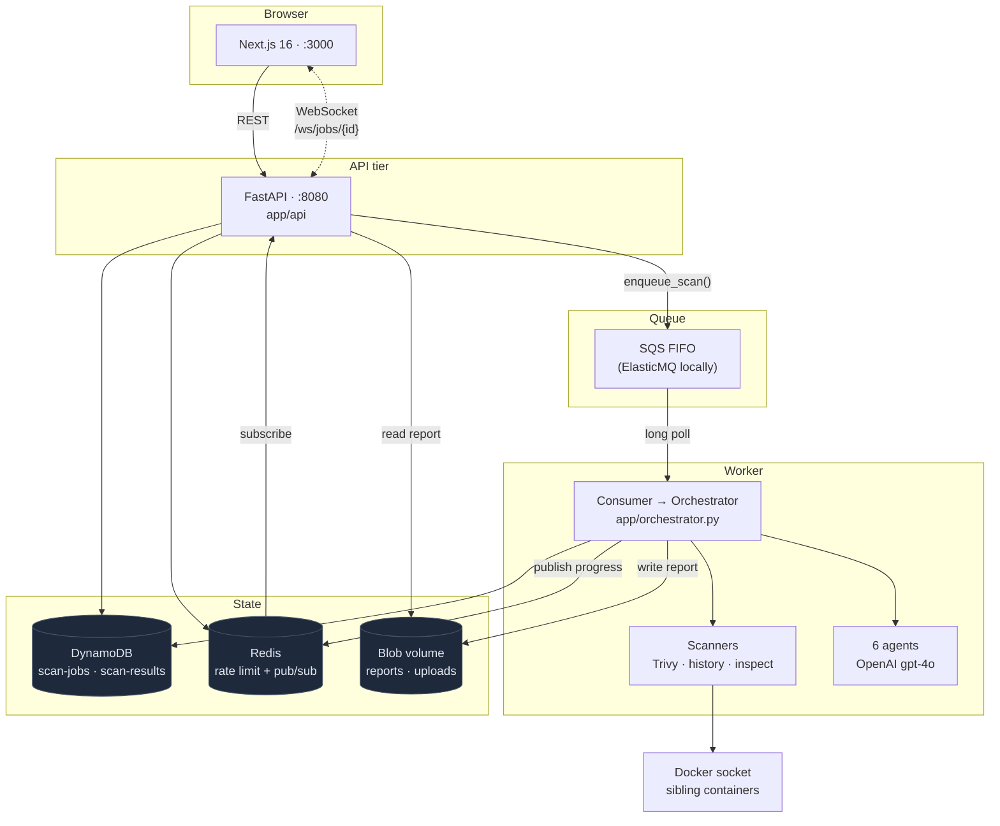

# Architecture overview

**Audience:** anyone who needs to know what talks to what before changing it.
**Scope:** the running system as it is today. How it came to be that way is the
[build phases](../history/build-phases/README.md); what is wrong with it is the
[audits](../audits/README.md).

---

## Components

Redis carries progress because in-process fan-out cannot work once more than one API task exists -
the socket lives on whichever task the browser happened to reach, and the scan runs somewhere else
entirely. DynamoDB is written **before** the publish: the database is the source of truth, and a
client that misses an event recovers by reading state, so a Redis outage must not fail a working scan.

---

## Where each piece lives

| Component | Code |
|---|---|
| API routes, auth deps, WebSocket | `worker/app/api/` |
| Scanners - Trivy, `docker history`, `docker inspect` | `worker/app/scanners/` |
| Deterministic reduction before any model call | `worker/app/processors/` |
| The six agents, prompts, trust fan-in | `worker/app/agents/` |
| SQS producer, consumer, handler | `worker/app/queue/` |
| DynamoDB tables, blobs, Decimal serialization | `worker/app/storage/` |
| Instruments and JSON logs | `worker/app/telemetry/` |
| Next.js 16 App Router | `frontend/` |
| 11 modules on Fargate | `terraform/` |

---

## Related

- [The scan pipeline](pipeline.md) - what happens inside the worker box
- [Observability](observability.md) - what each component reports about itself
- [Configuration](../operations/configuration.md) - the variables that wire them together
