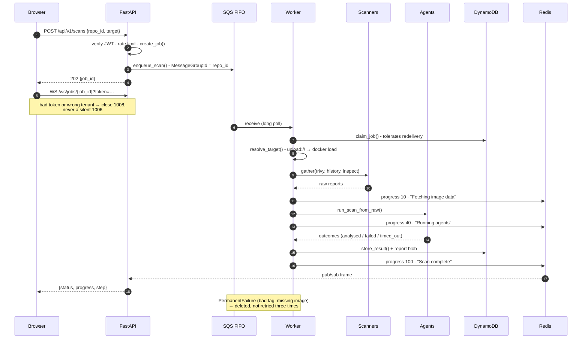
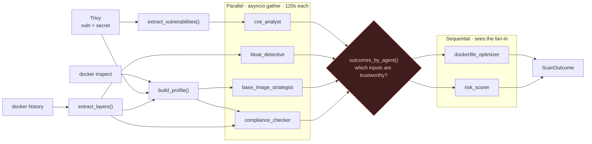

# The scan pipeline

**Audience:** anyone changing the orchestrator, an agent, or the progress protocol.
**Scope:** one scan, from `POST /api/v1/scans` to a stored report. The component
diagram is in [the architecture overview](overview.md).

---

## The scan lifecycle

Every progress write is `update_progress()` **then** `bus.publish()`, and the publish sits in its own
`try` - delivery of a progress event is a nice-to-have, the scan result is not.

---

## The agent graph

The fan-in is the interesting part. `app/agents/trust.py` answers *which of my inputs can I believe?* -
`missing_inputs()` names the required agents whose output cannot be trusted, and `input_confidence()`
returns the fraction that can. The dependent agents receive that verdict rather than a silently
shorter list, so `risk_scorer` knows the difference between "no critical CVEs" and "the CVE agent
never ran".

`asyncio.gather(..., return_exceptions=True)` plus `_degrade()` is what keeps one bad agent from
killing five good ones.

---

## Related

- [Architecture overview](overview.md) - the components this runs across
- [Observability](observability.md) - `agent_outcome_total`, `agent_duration_seconds` and the
  guard-rejection counter come from these same call sites
- [The LLM gateway](llm-gateway.md) - what the six agents cost
- Build phases [03](../history/build-phases/03-parallel-agents.md) and
  [04](../history/build-phases/04-dependent-agents.md) - how the fan-out and the fan-in were built
